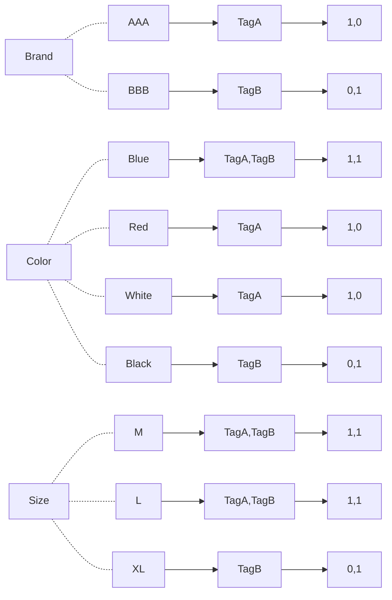

# tracer
- 索引，是为了加快信息主体查找过程，基于目标信息主体，预先创建的一种储存结构。
- 倒排索引（Inverted index），是一种索引方法，基于信息主体的属性值进行构建。
- 本工程基于Map+BitSet结构，采用：属性->属性值->信息主体唯一标识，预先构建倒排索引，加速查找过程。

## 索引存储

定义标签属性【Brand，Color，Size】

标签A

| 属性名        | 属性值           |
| ------------- | ---------------- |
| Brand（品牌） | AAA              |
| Color（颜色） | Blue，Red，White |
| Size（尺寸）  | M，L             |

标签B

| 属性名        | 属性值      |
| ------------- | ----------- |
| Brand（品牌） | BBB         |
| Color（颜色） | Blue，Black |
| Size（尺寸）  | M，L，XL    |

